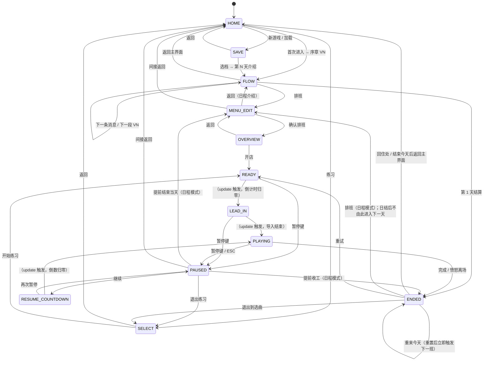

# 游戏状态机

`src/state.js` 导出 `S`（状态常量枚举）与 `TRANSITIONS`（有效转移邻接表）。

## 状态列表

| 常量 | 字符串值 | 说明 |
|---|---|---|
| `S.HOME` | `'home'` | 标题主界面 |
| `S.SAVE` | `'save'` | 存档槽选择 |
| `S.FLOW` | `'flow'` | VN 对话 / 日程介绍 / 结算消息 |
| `S.MENU_EDIT` | `'menuEdit'` | 排班编辑器 |
| `S.OVERVIEW` | `'overview'` | 开店前日程预览 |
| `S.SELECT` | `'select'` | 练习选曲界面 |
| `S.READY` | `'ready'` | 开始前倒计时 |
| `S.LEAD_IN` | `'leadIn'` | 导入动画（音符从顶部扫入） |
| `S.PLAYING` | `'playing'` | 游戏进行中 |
| `S.PAUSED` | `'paused'` | 暂停 |
| `S.RESUME_COUNTDOWN` | `'resumeCountdown'` | 继续前 3-2-1 倒数 |
| `S.ENDED` | `'ended'` | 结算/结果界面 |

## 状态转移图



**备注 — 日与下一天：** 当日经营的 **日结面板**（`resultMode === 'day'`）只提供「回住处」「升级店铺」等；不会在结算页 **`advanceDay()`**。进入下一游戏日须经 **主界面 HOME** →「开始新一天」。

## C++ 映射

```cpp
enum class GameState {
    Home, Save, Flow, MenuEdit, Overview,
    Select, Ready, LeadIn, Playing,
    Paused, ResumeCountdown, Ended
};
```

转移守卫在 C++ 端对应 `StateMachine::TryTransition(GameState next)` 方法，参照 `TRANSITIONS` 邻接表实现断言或日志。
